# Global Architecture
This project is a cross-platform school application based on Kotlin Multiplatform, enabling code sharing between Android, iOS, Web, and Desktop. The application is designed with the following principles:

- **Cross-platform**: Common code is written in Kotlin, with platform-specific implementations when necessary.
- **Modularity**: Use of modules to better organize code and ensure reusability.

## Software Architecture
We have one file for each page of the application.

The architecture follows a modular and maintainable approach.
### 1. **Cross-Platform Modules**
   - **Core Module**: Contains the application logic shared across all platforms, including data models, networking, and resource management.
   - **Platform-Specific Modules**: Provide necessary implementations for each platform (Android, iOS, etc.), such as interactions with native APIs.
   - **Shared UI Module**: Includes cross-platform UI components built with JetBrains Compose.

### 2. **Separation of Concerns**
   - Each module has a clear responsibility to ensure maintainability.
   - Dependencies are injected via frameworks like Koin or Hilt.

## ViewModel
The project appears to follow the MVVM architecture, but we didn't take care of the database part. 

So we haven't any "model".

## UI with Compose
The project uses JetBrains Compose, a UI framework inspired by Jetpack Compose.

# Dependencies
Here are the main plugins and libraries used:

- **Gradle Plugins**:
  - `androidApplication`
  - `androidLibrary`
  - `jetbrainsCompose`
  - `kotlinMultiplatform`

- **Libraries**:
  - JetBrains Compose for UI.
  - Kotlinx Serialization for data serialization.
  - Ktor for network calls.
  - SQLDelight for local database management.

# Supported Target
Any devices on Android, IOS, Windows or MacOS

# How to run
1. Clone the repository.
2. Set up the environment with Android Studio.
3. Synchronize Gradle dependencies.
4. Run the application on an emulator or physical device.

When you are on the first page you have the choice between four pages : Calendar, Classes, Collaboration and Grades.

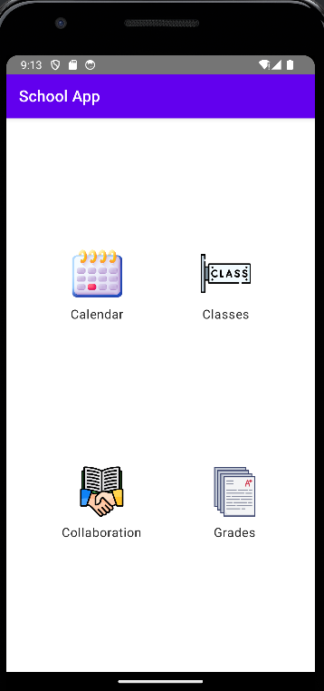

## Calendar 
Calendar is where you can see your planning. You have different view : monthly, weekly or daily. You can add en event by clicking on the date of the day and you also have access to a to do list via the floating button.

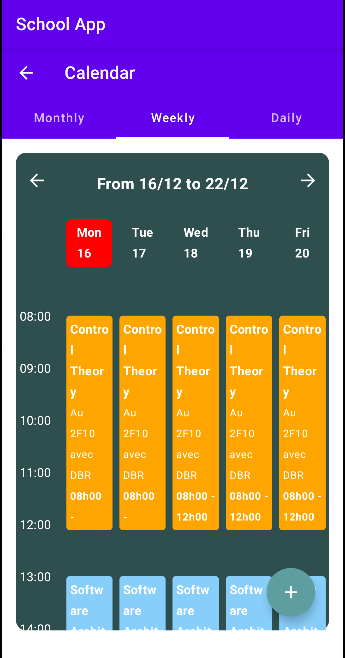 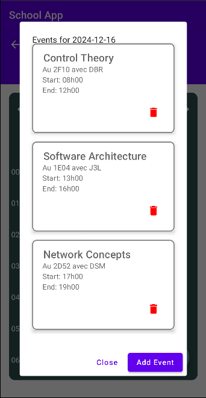 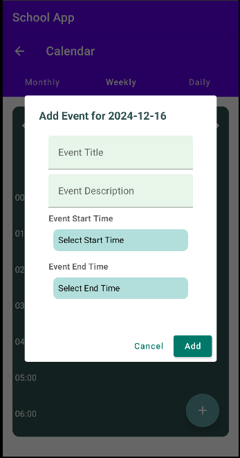 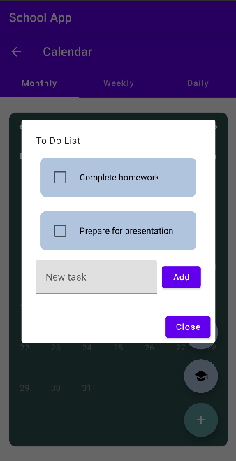

## Classes
Classes is the page where you can enter which courses you are taking. You'll have access to all the details of the course and to the files the teacher has made available. You'll also have access to a list of all teachers. 

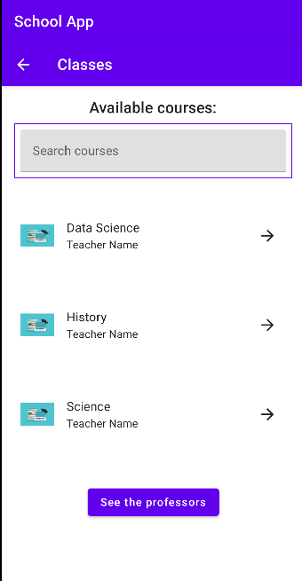 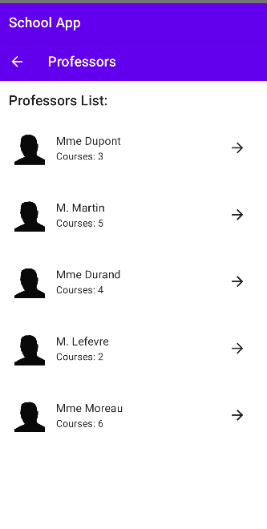

## Collaboration
Collaboration is a page where you will have different options : Forum, Sales, Docs and Private Lessons. Forum is a place where you can ask question to anyone. Sales is a place to sell/buy student’s material from previous years. Docs is where you can share or find synthesis and any other docs from previous years. Private lessons is where you can search for tutors.   

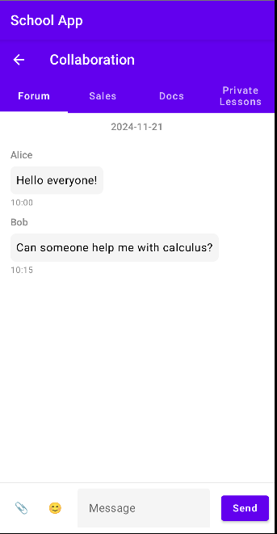 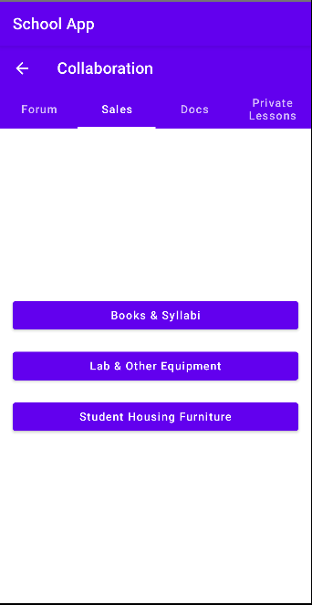 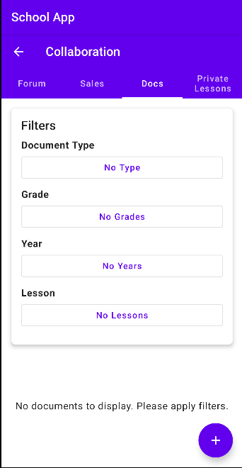 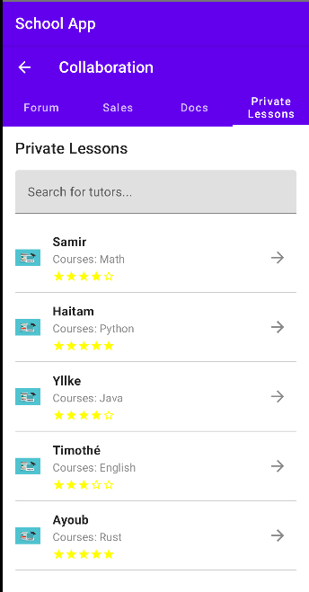

## Grades
Grades is the page where you will see your grades and every details of your evaluation. There would be a tool that helps you to calculate your average score and the score that you have to do if you want to pass a course. 

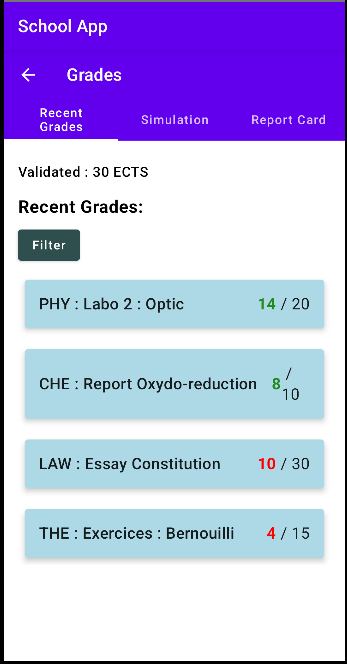 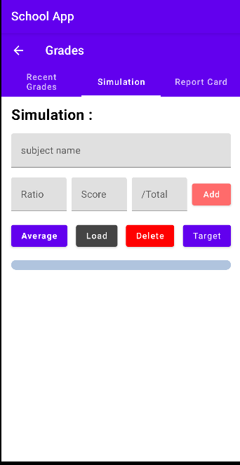 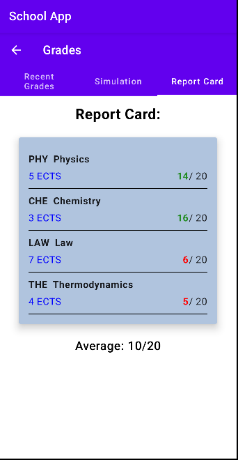
